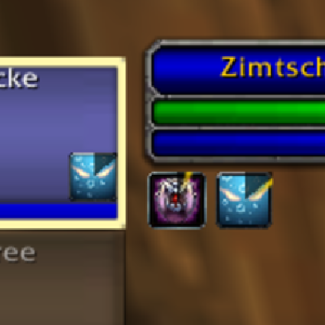
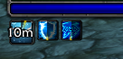
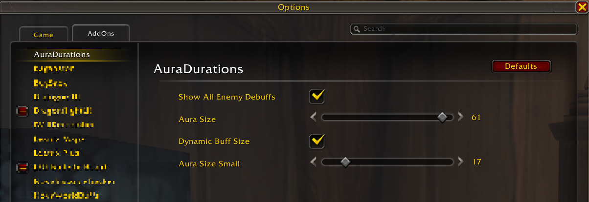

# \# AuraDurations

Simple addon to bring back buff/debuff swipe timers for the **default** TargetFrame and CompactRaidFrame on Era.

## Features

(Era only)

Adds the cooldown swipe texture to buffs and debuffs on the TargetFrame and CompactRaidFrame; similar to _ClassicAuraDurations_ (which seems abandoned). 

Also adds simple configuration for:
  - Show All Enemy Debuffs | If false, filters out non player debuffs on the target
  - Aura Size
  - Dynamic Buff Size | Highlights player buffs/debuffs on the target by increasing their aura size
  - Aura Size Small | AuraSize of non player buffs/debuffs when using 'Dynamic Buff Size'

Uses the default API and is based on blizzard code from TBC onwards; also uses [LibClassicDurations](https://github.com/rgd87/LibClassicDurations) to improve results.

## Screenshots

## For addon developers

Source code released under MIT licence.

Can be embeded (as the initial purpose was adding this functionality to [DragonflightUI classic](https://www.curseforge.com/wow/addons/dragonflight-ui-classic)).
